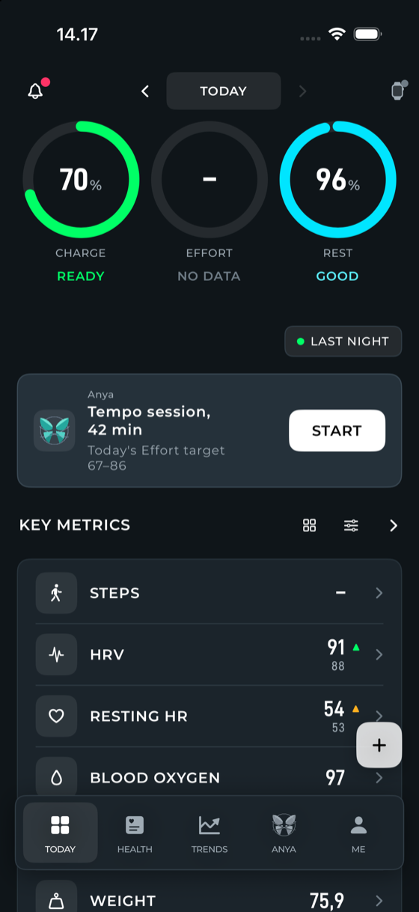
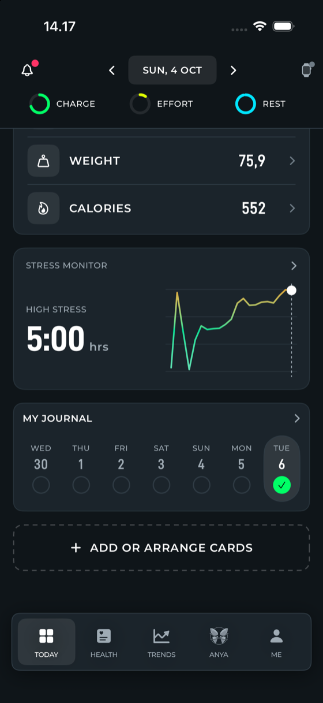
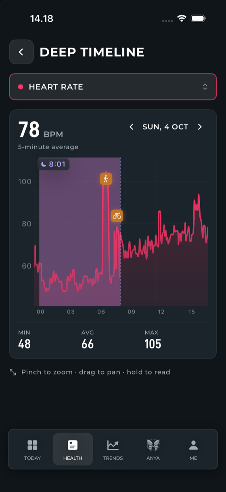
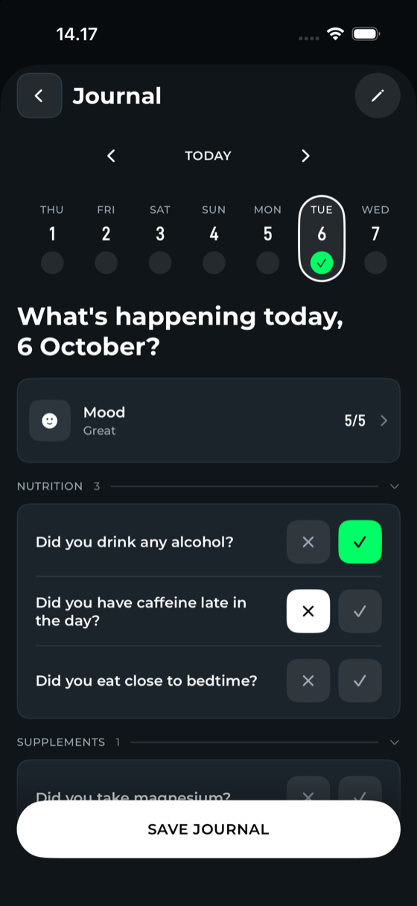
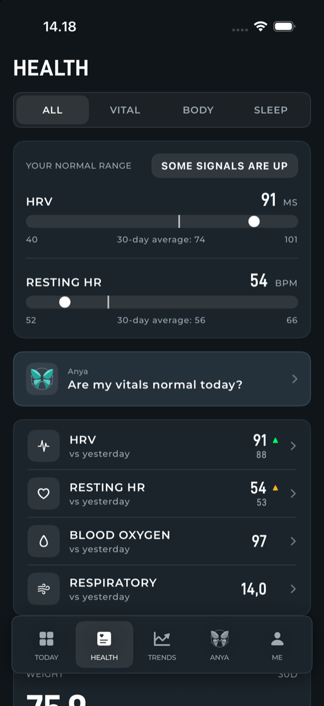
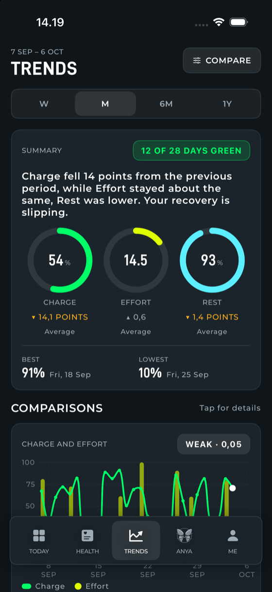
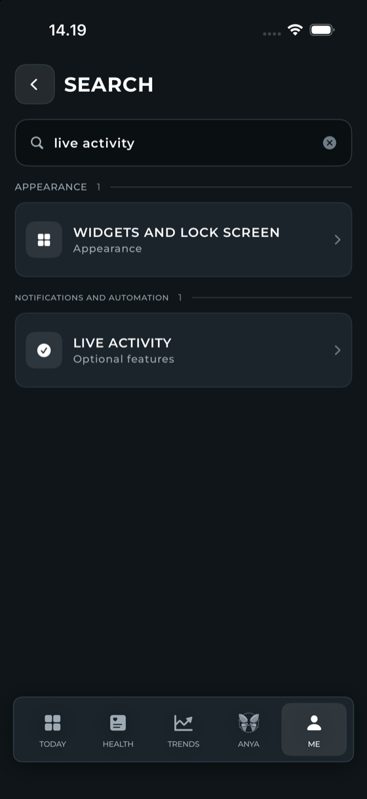
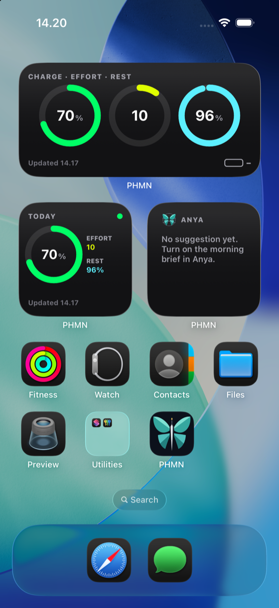

  

<h1 align="center">PHMN</h1>

<b>A WHOOP companion for iPhone that reads your day and tells you what to do next.</b>

A personal fork of <a href="https://github.com/ryanbr/noop">NOOP</a>. Offline, on-device, no account, no cloud.

  
  
  
  

---

## Why this fork exists

[NOOP](https://github.com/ryanbr/noop) is an excellent open-source, local-first app for WHOOP straps: it pairs over Bluetooth,
keeps everything on your device, and computes recovery, strain, HRV and sleep itself. It shows a lot, and it shows it in a
spreadsheet-like way.

I forked it because I wanted the app to answer a few questions the moment I open it: **how recovered am I, what should I do
today, and how is the day going?** PHMN keeps NOOP's engine and rebuilds the iPhone app around those answers, with a calmer design,
a coach that reacts to the day, and the widgets and Live Activities that make it useful without opening it.

## What's new compared with NOOP

### A redesigned app: Nuna

Today, Health, Trends, Anya and Me are redrawn in a new design called **Nuna**. NOOP's original look is still one switch away.

- **Today** pins your three scores (Charge, Effort, Rest) as rings at the top, then Anya, your key metrics, the stress monitor and your
  journal. Cards can be hidden and rearranged, and the key metrics show the change against yesterday and the previous value.
- **Two styles.** *Default* is the black-and-neon Nuna look. **WHP** is a slate night look with capital-letter labels set in
  D-DIN-PRO and Montserrat, with sentences and Anya's words kept in normal case so they stay easy to read.
- **Health** has four tabs (All, Vital, Body, Sleep). Every metric opens one chart card with a W / M / 6M switch inside it, so the figure,
  the range and the chart sit together.
- **Trends** compares Charge, Effort and Rest over a week, a month, six months or a year, with zone-coloured weekly patterns, a Charge
  heat map and a daily-signals grid (HRV, resting heart rate, stress, steps).
- **Me** is the settings hub, with **search that reaches the setting itself** (type "live activity" and it opens the right switch) and a list of
  the settings you opened last.
- Indonesian is a first-class language (see [docs/IOS_INDONESIAN_LOCALIZATION.md](docs/IOS_INDONESIAN_LOCALIZATION.md)).

  
  
  
  

### Anya, a coach that reacts to the day

Anya is the assistant built into the app. She reads your computed scores (never raw data off your phone unless you ask) and answers in
plain language. You bring your own provider and key, run a local model, or use Apple Intelligence on the device.

The card on Today changes with the day instead of repeating itself:

| When | What Anya shows |
|---|---|
| Morning | Today's session, built from your Charge, yesterday's Effort and your recent load, with today's **Effort target** and a Start button |
| A session is running | The sport, minutes, average heart rate and the Effort building up, with a button back to the live screen |
| After a session | What it earned (`Effort +38`) against today's target, with a progress bar |
| Target reached | The Start button goes away and the card turns to recovery: rest, water, an early night |
| After 20:00 | A prompt to fill in the journal and mood, or a note to wind down once it is done |

**The Effort target** is the range worth aiming for today, set by your Charge: green Charge points to 14–18 on WHOOP's 0–21 scale,
yellow to 10–14, red to 4–10. It is shown on whichever Effort scale you chose in Settings. Everything on the card is computed on the
phone from data the app already has; no model is involved in this card.

### Deep timeline

The per-second view of your day, redrawn. One dropdown picks the signal (heart rate, HRV, SpO₂, skin temperature, respiration, motion, sleep
state), one chart shows the whole day with your sleep and workouts marked on it, and the latest reading sits at the right edge. Pinch to zoom,
drag to pan, hold to read an exact value.

### Stress, as a number you can act on

The stress monitor now says what matters: **today's high stress as a time** (`2:00 hrs`), how it compares with **a typical day of the week**,
and the day's stress curve with a marker on the latest reading. The same card is a Home Screen widget.

### A journal you actually finish

Step through the week, answer with a cross or a check (tap again to clear), set a number with a stepper, add your own questions, and close it
with **Save journal**. An evening notification reminds you at a time you choose, and Anya picks the journal up after 20:00. Mood has its own
check-in screen (mood, what affected it, energy, a note) and the journal links straight to it.

### Widgets and Live Activities

- **Widgets:** Score (Charge, Effort and Rest as rings), Vital sign (choose which vitals), Heart rate (live, with the last three hours), Stress,
  Anya's morning brief, Steps with your target, and the PHMN Rings glance. Home Screen and Lock Screen.
- **Live Activities** for a workout, a lift session and a strap sync, on the Lock Screen and in the Dynamic Island, with the heart-rate zone, time,
  calories and a progress ring toward your target.

### Live workouts, with a voice

A workout screen with a ring that fills toward your time or distance target, a heart-rate card with a zone bar, and tiles for pace, distance,
cadence or time in zone depending on the sport. The audio coach speaks check-ins and tells you when a time or distance target is reached.

### And a few smaller things

- Two app icons to choose from (the orbit and the butterfly), and a clean-up on first launch that moves an install upgraded from NOOP over to PHMN.
- Quick actions behind the `+`, with six shortcuts you can change, and today's water.
- A tab bar that steps aside while you type, and keyboards that close when you tap away.

The Bluetooth, strap protocol, storage, sleep staging and scoring are NOOP's, unchanged.

## Status

A personal build for my iPhone and my WHOOP strap. NOOP's Mac and Android apps are still in the repository but are not reworked beyond the name.
Everything the app shows is an estimate, not medical advice. The screenshots above are from the iOS simulator with sample data.

## Build and run on an iPhone

Needs a Mac with Xcode and [XcodeGen](https://github.com/yonaskolb/XcodeGen).

1. `cp Config/BundleIdSecrets.example.xcconfig Config/BundleIdSecrets.xcconfig`, then set your own `BUNDLE_ID_PREFIX` and
   `DEVELOPMENT_TEAM` in it. That file is gitignored.
2. `xcodegen generate`
3. Open `Strand.xcodeproj`, choose the **NOOPiOS** scheme and your iPhone, and run.

**Sideloading an IPA.** Build an unsigned archive without the Watch app, run `Tools/prepare-ios-sideload-app.sh` on the `.app` so the widget keeps its
App Group request, zip it as `Payload/PHMN.app`, and sign it with your own sideloader (AltStore or SideStore). With a free Apple ID, HealthKit
is not available to a sideloaded build; the details are in [docs/IOS.md](docs/IOS.md).

Pairing a WHOOP 5.0 / MG needs the strap freed from the official WHOOP app first; see [docs/IOS.md](docs/IOS.md) and the pairing notes in
[NOOP's README](https://github.com/ryanbr/noop#readme). The design notes for Nuna are in [docs/nuna](docs/nuna).

## Credit

All the hard work under the hood belongs to **NOOP** and its contributors: [github.com/ryanbr/noop](https://github.com/ryanbr/noop). NOOP in turn
builds on [johnmiddleton12/my-whoop](https://github.com/johnmiddleton12/my-whoop) and [b-nnett/goose](https://github.com/b-nnett/goose); see
[ATTRIBUTION.md](ATTRIBUTION.md) and [NOTICE](NOTICE).

NOOP's own README is kept as [docs/NOOP_README.md](docs/NOOP_README.md). The documents in [`docs/`](docs/), [CHANGELOG.md](CHANGELOG.md) and the
contributor guides are NOOP's and describe NOOP.

Fonts: D-DIN-PRO and Montserrat, both under the SIL Open Font License.

## License

PHMN is a fork of NOOP and stays under NOOP's license, [PolyForm Noncommercial 1.0.0](LICENSE): free for noncommercial use.

Required Notice: Copyright 2026 NoopApp

PHMN is not affiliated with, endorsed by, or connected to WHOOP, Inc. or the NOOP project. "WHOOP" is used only to identify the hardware the app
works with.
