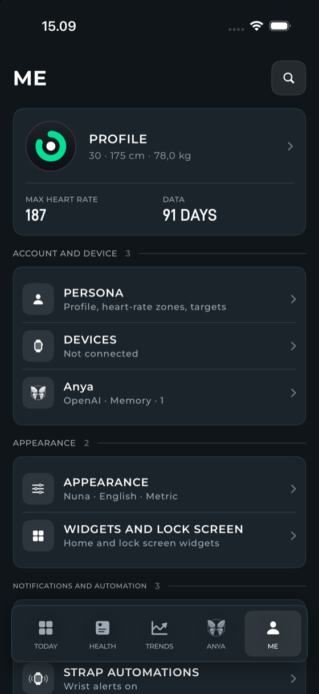
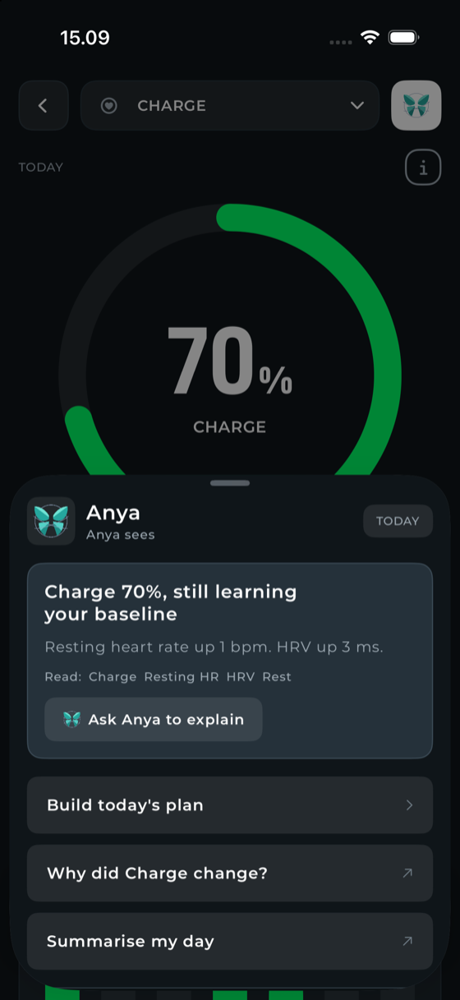
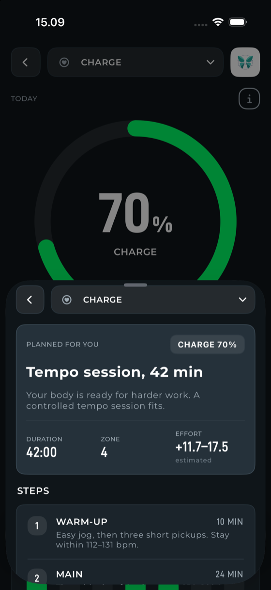
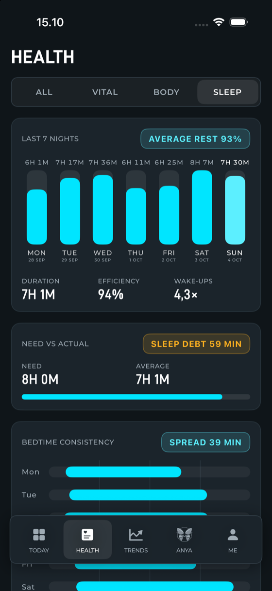
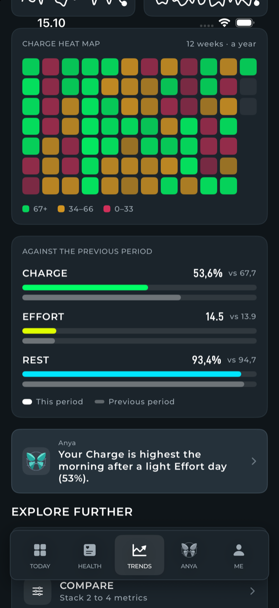

  

<h1 align="center">PHMN</h1>

<b>NOOP, reshaped around my own routine.</b>

A personal project, built for my own needs. Offline, on-device, no account, no cloud.

  
  
  
  

---

## A personal project

PHMN is a fork of [NOOP](https://github.com/ryanbr/noop), the open-source app that reads a WHOOP strap over Bluetooth and keeps every number on
your phone. I did not set out to build a product. I use a WHOOP, I wanted the iPhone app to behave the way **I** check my day, and so I changed
it until it did. Everything here follows my own habits and needs; it may not fit yours, and I make no promise that it will.

The strap protocol, storage, sleep staging and scoring underneath are NOOP's, unchanged. What I changed is what sits on top.

## What differs from NOOP

| Area | NOOP | PHMN |
|---|---|---|
| **Look** | One design | A new design, *Nuna*, in two styles (Default and WHP). NOOP's look is one switch away |
| **Today** | A dashboard of cards | Charge, Effort and Rest pinned as rings, then the coach, key metrics with the change since yesterday, the stress card and a journal strip |
| **Coach** | Optional coach screen | **Anya** on Today follows the day: the morning plan with an Effort target, the running session, what a finished one earned, a rest note once the target is met, a journal prompt after 20:00 |
| **Health** | Metric explorer | Four tabs (All, Vital, Body, Sleep). Each metric is one card with a W / M / 6M switch inside the chart |
| **Trends** | Per-metric charts | Week, month, six months and year, zone-coloured weekday patterns, a Charge heat map, a daily-signals grid |
| **Stress** | A 0 to 3 score | Today's high-stress time, a "now" level, a comparison with a typical weekday, the day's curve; also a widget |
| **Journal** | A list of questions | A week strip, check/cross answers, steppers, your own questions, an evening reminder, a link to the Mood check-in |
| **Settings** | A long settings screen | **Me**: grouped hub with search that reaches individual settings and a list of the ones you opened last |
| **Widgets** | Rings and heart rate | Score, Vital sign, Heart rate, Stress, Anya, Steps and Rings |
| **Live Activities** | Strap sync | Workout, lift session and strap sync, on the Lock Screen and in the Dynamic Island |
| **Workouts** | Live screen | A hub with three tabs (Workout, Gym, Insight), a target ring, heart-rate zones, sport-specific tiles, and a Today card listing the day's sleep and every workout |
| **Gym** | A lift log | Its own tab: programs you can group into folders, a Hevy-style full-screen session (sets, weight, reps, RPE, rest timer, a tone when rest ends), and a library of 876 exercises with photos and the muscles each works. A body map shows which muscles are trained and which are still tired |
| **Audio coach** | None | Spoken cues in a workout: heart-rate zone alerts, distance milestones and optional smart cues, at a speed you choose. Short tones for the rest end in the gym. It plays over your music and lowers it for a moment, and has a test button that says what the phone did |
| **Sleep** | One night chart | The night now ends where the strap stopped recording, not where the session happened to close (a night that ended at 05:52 no longer reads 06:24). The stage chart has five styles to pick in Settings (Classic, Fitbit, Fill, Garmin, Ribbon), and the vitals charts label every hour |
| **Strava** | Not included | Upload GPS and treadmill workouts, off by default. Bring your own key: you create a Strava API app and enter its Client ID and Secret, which stay in the Keychain. Needs a Strava premium account |
| **Hevy** | Not included | Import your workouts and routines from Hevy with your own API key, read only: the app never writes to Hevy. The Hevy API is part of Hevy Pro. Off by default, one tap to import, nothing runs in the background |
| **Language** | English first | Indonesian is a first-class language |

## Screens

### Me

The hub is grouped and ruled, and the search finds the setting itself. Type "live activity" and it opens the right switch.

  
  

### Anya

The assistant reads your computed scores, not raw data, and answers in plain language. You bring your own provider and key, run a local model,
or use Apple Intelligence on the device. From any score screen she can explain it or build the day's session, with the Effort that session
should earn.

The Effort target comes from your Charge: green points to 14–18 on WHOOP's 0–21 scale, yellow to 10–14, red to 4–10, shown on whichever
Effort scale you chose.

  
  

### Health

One card per metric, and a Sleep tab that puts the week, the need against the actual and the bedtime spread on one screen.

  
  

### Trends

  
  

## Status

Built and tested on my own iPhone with my own strap. NOOP's Mac and Android apps are still in the repository but are not reworked beyond the
name. Everything the app shows is an estimate, not medical advice. The screenshots are from the iOS simulator with sample data.

Releases: [v0.1.0](https://github.com/aansun/PHMNoop/releases/tag/v0.1.0) has an unsigned IPA for sideloading.

## Build and run

Needs a Mac with Xcode and [XcodeGen](https://github.com/yonaskolb/XcodeGen).

1. `cp Config/BundleIdSecrets.example.xcconfig Config/BundleIdSecrets.xcconfig`, then set your own `BUNDLE_ID_PREFIX` and
   `DEVELOPMENT_TEAM`. That file is gitignored.
2. `xcodegen generate`
3. Open `Strand.xcodeproj`, choose the **NOOPiOS** scheme and your iPhone, and run.

**Sideloading the IPA.** The release IPA is unsigned and has no Apple Watch app. Sign it with your own sideloader (AltStore or SideStore). With a
free Apple ID, HealthKit is not available to a sideloaded build; the details are in [docs/IOS.md](docs/IOS.md). To build one yourself, archive without
the Watch app, run `Tools/prepare-ios-sideload-app.sh` on the `.app` so the widget keeps its App Group request, and zip it as `Payload/PHMN.app`.

Pairing a WHOOP 5.0 / MG needs the strap freed from the official WHOOP app first; see [docs/IOS.md](docs/IOS.md) and
[NOOP's README](https://github.com/ryanbr/noop#readme). Design notes for Nuna are in [docs/nuna](docs/nuna).

## Credit and license

**Gym.** The gym screens stand on other people's work, all of it open:

- **[MuscleMap](https://github.com/melihcolpan/MuscleMap)** by Melih Colpan, MIT licence: the body map.
- **[free-exercise-db](https://github.com/yuhonas/free-exercise-db)** by yuhonas, The Unlicense (public domain): the 876 exercises, their muscles and instructions, and the two photos of each.
- **[openGym](https://github.com/DuarteSantos8/openGym)** by Duarte Santos, GNU AGPL-3.0: the idea of a body map of trained and tired muscles came from it. No openGym code, data, photos or animations are in PHMN; the readings here are written from your logged sets.

The full licence texts are in [THIRD_PARTY_NOTICES.md](THIRD_PARTY_NOTICES.md) and in the app under **Me › About and help › Open-source notices**.

**NOOP.** Everything underneath is **NOOP** and its contributors: [github.com/ryanbr/noop](https://github.com/ryanbr/noop). NOOP builds on
[johnmiddleton12/my-whoop](https://github.com/johnmiddleton12/my-whoop) and [b-nnett/goose](https://github.com/b-nnett/goose); see
[ATTRIBUTION.md](ATTRIBUTION.md) and [NOTICE](NOTICE). NOOP's own README is kept as [docs/NOOP_README.md](docs/NOOP_README.md), and the documents
in [`docs/`](docs/) and [CHANGELOG.md](CHANGELOG.md) describe NOOP. Fonts: D-DIN-PRO and Montserrat, under the SIL Open Font License.

PHMN stays under NOOP's license, [PolyForm Noncommercial 1.0.0](LICENSE): free for noncommercial use.

Required Notice: Copyright 2026 NoopApp

PHMN is not affiliated with, endorsed by, or connected to WHOOP, Inc., Strava, Inc., Hevy or the NOOP project. "WHOOP", "Strava" and "Hevy" are used
only to identify the hardware and services the app works with.
