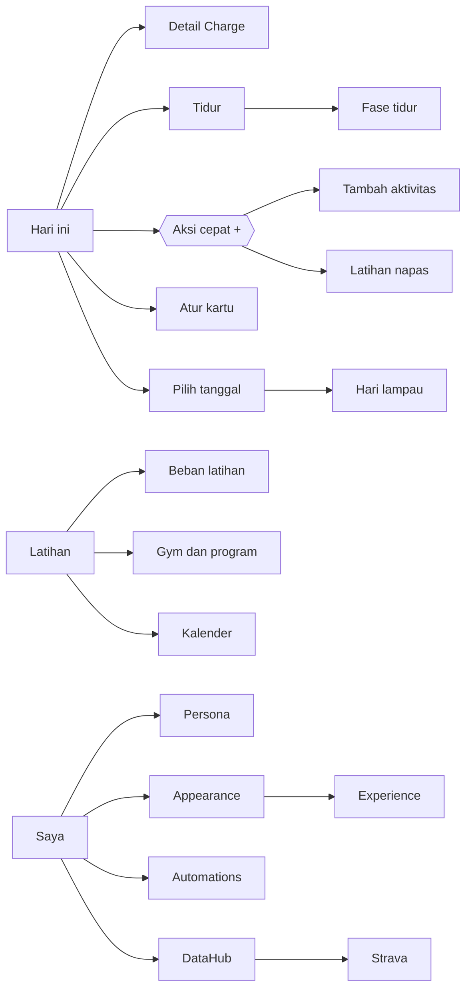

# Navigation

## Tabs

`Hari ini` (Today) · `Kesehatan` (Health) · `Tren` (Trends) · `Anya` · `Saya` (Me)

The floating "+" on Today opens the **Quick actions** sheet. The contextual Anya card and the Anya icon in detail headers open a per-module Anya sheet (see `AnyaPattern`).

## Cross-module links

| From | To | Links |
|---|---|---|
| Saya | Hari ini | 34 |
| Saya | Kesehatan | 31 |
| Kesehatan | Hari ini | 30 |
| Saya | Anya | 29 |
| Saya | Tren | 27 |
| Hari ini | Anya | 23 |
| Hari ini | Kesehatan | 23 |
| Kesehatan | Anya | 22 |
| Hari ini | Saya | 20 |
| Hari ini | Tren | 20 |
| Kesehatan | Saya | 19 |
| Kesehatan | Tren | 19 |
| Tren | Hari ini | 18 |
| Latihan | Hari ini | 14 |
| Latihan | Anya | 13 |
| Latihan | Saya | 13 |
| Anya | Hari ini | 12 |
| Tren | Anya | 11 |
| Tidur | Anya | 11 |
| Latihan | Kesehatan | 11 |
| Latihan | Tren | 11 |
| Saya | Perangkat | 10 |
| Tren | Kesehatan | 10 |
| Tren | Saya | 10 |
| Anya | Kesehatan | 10 |
| Anya | Tren | 9 |
| Hari ini | Latihan | 8 |
| Tidur | Kesehatan | 8 |
| Tidur | Hari ini | 8 |
| Anya | Saya | 8 |
| Perangkat | Anya | 8 |
| Perangkat | Hari ini | 8 |
| Perangkat | Saya | 8 |
| Tidur | Saya | 7 |
| Tidur | Tren | 7 |
| Perangkat | Kesehatan | 7 |
| Perangkat | Tren | 7 |
| Hari ini | Tidur | 6 |
| Saya | Latihan | 4 |
| Hari ini | Perangkat | 2 |
| Tren | Tidur | 2 |
| Anya | Tidur | 2 |
| Anya | Latihan | 2 |
| Widget | Anya | 2 |
| Widget | Kesehatan | 2 |
| Widget | Hari ini | 2 |
| Widget | Saya | 2 |
| Widget | Tren | 2 |
| Kesehatan | Tidur | 1 |
| Kesehatan | Latihan | 1 |
| Anya | Perangkat | 1 |
| Saya | Widget | 1 |
| Saya | Tidur | 1 |

## Key flows

Every row in `SCREENS.md` lists its outgoing links. The main flows:

